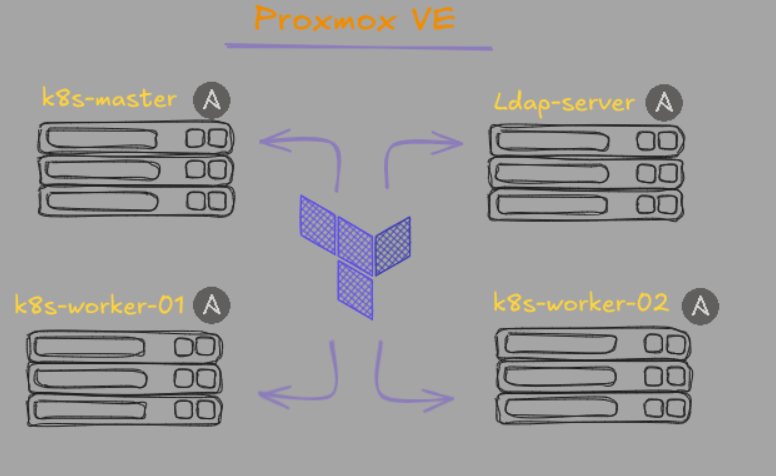
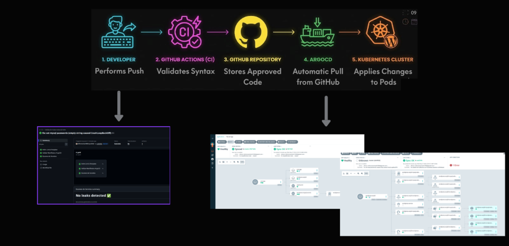

# ARQ3D Infrastructure

> **Proyecto de Infraestructura Proxmox-Kubernetes**  
> Infraestructura cloud-native completa sobre Proxmox VE, orquestada con Terraform, Ansible, K3s y ArgoCD.

---

## Tabla de contenidos

1. [Visión general](#1-visión-general)
2. [Arquitectura](#2-arquitectura)
3. [Requisitos previos](#3-requisitos-previos)
4. [Estructura del repositorio](#4-estructura-del-repositorio)
5. [Capa 1 — Terraform: aprovisionamiento de VMs](#5-capa-1--terraform-aprovisionamiento-de-vms)
6. [Capa 2 — Ansible: configuración base del SO](#6-capa-2--ansible-configuración-base-del-so)
7. [Capa 3 — K3s: clúster Kubernetes](#7-capa-3--k3s-clúster-kubernetes)
8. [Capa 4 — ArgoCD: GitOps y despliegue de aplicaciones](#8-capa-4--argocd-gitops-y-despliegue-de-aplicaciones)
9. [Aplicaciones desplegadas](#9-aplicaciones-desplegadas)
10. [Seguridad](#10-seguridad)
11. [Guía de despliegue completo](#11-guía-de-despliegue-completo)
12. [Troubleshooting](#12-troubleshooting)
13. [Glosario](#13-glosario)

---

## 1. Visión general

Este repositorio contiene la **infraestructura** del proyecto ARQ3D. El objetivo es demostrar un stack de infraestructura que cubra desde el aprovisionamiento bare-metal hasta el despliegue continuo de aplicaciones

### Stack tecnológico

| Capa | Tecnología | Propósito |
|---|---|---|
| Virtualización | Proxmox VE | Hipervisor bare-metal |
| IaC — VMs | Terraform + `telmate/proxmox` | Aprovisionamiento declarativo de VMs |
| IaC — K8s | Terraform + Helm provider | Despliegue de controladores en K8s |
| Configuración OS | Ansible + roles | Hardening, NFS, K3s, LDAP |
| Clúster K8s | K3s (lightweight Kubernetes) | Runtime de contenedores |
| GitOps | ArgoCD v2 (App-of-Apps) | Despliegue continuo desde Git |
| Ingress | NGINX Ingress Controller | Enrutamiento HTTP/HTTPS |
| Secretos | Sealed Secrets | Cifrado de secretos en Git |
| Identidad | OpenLDAP | Autenticación centralizada |
| Almacenamiento | TrueNAS NFS | Volúmenes persistentes |
| Aplicaciones | WordPress + MySQL (Helm) | Web corporativa |

---

## 2. Arquitectura






### Orden de despliegue (capas)

```
[1] Terraform (proxmox) → crea VMs
[2] Ansible             → configura OS (hardening + NFS + K3s + LDAP)
[3] Terraform (k8s)     → instala ArgoCD + NGINX + Sealed Secrets via Helm
[4] ArgoCD (GitOps)     → despliega aplicaciones desde este repo
```

---

## 3. Requisitos previos

### Herramientas locales necesarias

| Herramienta | Versión mínima | Instalación |
|---|---|---|
| Terraform | `>= 1.7.0` | https://developer.hashicorp.com/terraform/install |
| Ansible | `>= 2.15` | `pip install ansible` |
| kubectl | `>= 1.28` | https://kubernetes.io/docs/tasks/tools/ |
| Helm | `>= 3.12` | https://helm.sh/docs/intro/install/ |
| kubeseal | `>= 0.24` | https://github.com/bitnami-labs/sealed-secrets#installation |

### Infraestructura necesaria

- **Proxmox VE** accesible en red con token de API configurado.
- **Plantilla Cloud-Init** `ubuntu-2204-cloud-init` creada en Proxmox.
- **TrueNAS** con exports NFS configurados (para PVCs).
- **Par de claves SSH** ED25519 .

### Crear token de API en Proxmox

```bash
# En el shell de Proxmox o via UI:
pveum user add terraform@pam
pveum aclmod / -user terraform@pam -role PVEVMAdmin
pveum user token add terraform@pam tfg-token --privsep=0
# Guarda el UUID del secret que aparece — no se muestra dos veces.
```

---

## 4. Estructura del repositorio

```
TFG-asir/
│
├── terraform-proxmox/              # Capa 1: VMs en Proxmox
│   ├── versions.tf                 
│   ├── backend.tf                  
│   ├── variables.tf                
│   ├── main.tf                     
│   ├── outputs.tf                  
│   ├── terraform.tfvars.example    
│   ├── .gitignore
│   └── modules/
│       └── vm/                     
│           ├── main.tf
│           ├── variables.tf
│           ├── outputs.tf
│           └── README.md
│
├── ansible/                        # Capa 2: Configuración del SO
│   ├── ansible.cfg
│   ├── site.yml                    # Playbook principal (orquestador)
│   ├── inventory.yml               # Hosts: IPs estáticas de Terraform
│   ├── requirements.yml            # Roles externos (galaxy)
│   ├── group_vars/
│   │   ├── all.yml                 # Variables comunes
│   │   └── vault.yml               # Secretos cifrados con ansible-vault
│   ├── playbooks/
│   │   ├── 01-hardening.yml        # Hardening SSH + firewall + fail2ban
│   │   ├── 02-nfs.yml              # Montaje de volúmenes NFS
│   │   ├── 03-k3s.yml              # Instalación K3s (master + workers)
│   │   └── 04-ldap.yml             # Servidor OpenLDAP
│   └── roles/
│       ├── hardening/              # SSH, ufw, fail2ban
│       ├── k3s/                    # Install master + join workers
│       ├── ldap/                   # Instalar + configurar + ppolicy
│       └── nfs/                    # Montar exports NFS
│
└── k8s-cluster/                    # Capas 3 y 4: K8s + GitOps
    ├── k8s_argocd/
    │   └── argocd_terraform/       # Helm installs: ArgoCD + NGINX + SealedSecrets
    │       ├── providers.tf
    │       ├── main.tf
    │       └── versions.tf
    ├── argocd-apps/                # App-of-Apps: manifiestos gestionados por ArgoCD
    │   ├── 00-appproject.yaml      # Permisos y límites del proyecto
    │   ├── 01-root-app.yaml        # Root Application (gestiona este directorio)
    │   ├── 02-wordpress-app.yaml   # Application: WordPress via Helm
    │   └── 03-sealed-secret.yaml   # SealedSecret: credenciales MySQL (Git, cifrado) 
    └── wordpress/
        └── wordpress-mysql/        # Helm chart custom: WordPress + MySQL subchart
            ├── Chart.yaml
            ├── values.yaml         # Valores públicos
            ├── values-secrets.yaml.example
            └── templates/
                ├── 03-wordpress-deployment.yaml
                ├── 03-wordpress-pvc.yaml
                ├── 04-ingress.yaml
                └── 05-servicemonitor.yaml
```

---

## 5. Capa 1 — Terraform: aprovisionamiento de VMs

El directorio `terraform-proxmox/` gestiona el ciclo de vida de las 4 VMs mediante el módulo reutilizable `modules/vm`.

### VMs aprovisionadas

| VM | VMID | IP | vCPU | RAM | Disco | Rol |
|---|---|---|---|---|---|---|
| `k8s-master-01` | 110 | 192.168.10.10 | 2 | 4 GiB | 40 GiB | K8s Control Plane |
| `k8s-worker-01` | 111 | 192.168.10.11 | 4 | 8 GiB | 40 GiB | K8s Worker (Web + ArgoCD) |
| `k8s-worker-02` | 112 | 192.168.10.12 | 4 | 8 GiB | 40 GiB | K8s Worker (Nextcloud HA) |
| `ldap-server`   | 120 | 192.168.10.20 | 2 | 4 GiB | 30 GiB | OpenLDAP Identity |

### Despliegue

```bash
cd terraform-proxmox/

# 1. Copiar y rellenar variables
cp terraform.tfvars.example terraform.tfvars
# Editar terraform.tfvars con: URL de Proxmox, token, IPs, clave SSH pública

# 2. Inicializar providers
terraform init

# 3. Revisar el plan (NO aplica cambios)
terraform plan

# 4. Aprovisionar las VMs
terraform apply
```

> **Outputs exportados:** `vm_id`, `vm_name`, `ip` — disponibles con `terraform output`.

---

## 6. Capa 2 — Ansible: configuración base del SO

El directorio `ansible/` configura todos los nodos una vez que Terraform los ha creado. Los playbooks se ejecutan en orden secuencial.

### Playbooks

| Orden | Fichero | Acción | Hosts |
|---|---|---|---|
| 1 | `01-hardening.yml` | SSH hardening, UFW, fail2ban | `managed` (todos) |
| 2 | `02-nfs.yml` | Montaje de shares NFS (TrueNAS) | `managed` (todos) |
| 3 | `03-k3s.yml` | Instalar K3s master + unir workers | `k8s_cluster` |
| 4 | `04-ldap.yml` | OpenLDAP + ppolicy + estructura | `identity_servers` |

### Ejecución

```bash
cd ansible/

# Ejecución completa (recomendado para un despliegue limpio)
ansible-playbook site.yml --vault-password-file ~/.vault_pass

# Ejecución por capas (con tags)
ansible-playbook site.yml -t hardening
ansible-playbook site.yml -t nfs
ansible-playbook site.yml -t k3s
ansible-playbook site.yml -t ldap

# Verificar conectividad antes de desplegar
ansible all -m ping
```

### Secretos con Ansible Vault

El fichero `group_vars/vault.yml` contiene variables sensibles cifradas. **Nunca se commitea en texto plano.**

```bash
# Crear/editar secretos
ansible-vault edit group_vars/vault.yml

# Crear el fichero de contraseña (fuera del repo)
echo "mi-passphrase-segura" > ~/.vault_pass
chmod 600 ~/.vault_pass
```

---

## 7. Capa 3 — K3s: clúster Kubernetes

K3s es instalado por Ansible (`roles/k3s`). Una vez levantado el clúster, se instalan los controladores de infraestructura mediante Terraform con el provider Helm.

### Acceder al clúster

```bash
# Copiar kubeconfig desde el master
scp arq3d@192.168.10.10:/etc/rancher/k3s/k3s.yaml ~/.kube/config-arq3d

# Apuntar kubectl al nuevo clúster
export KUBECONFIG=~/.kube/config-arq3d

# Verificar nodos
kubectl get nodes -o wide
```

### Controladores instalados via Terraform (Helm)

```bash
cd k8s-cluster/k8s_argocd/argocd_terraform/

terraform init
terraform apply
```

| Controlador | Namespace | Versión | Función |
|---|---|---|---|
| ArgoCD | `argocd` | `7.x` | Gestor GitOps (App-of-Apps) |
| NGINX Ingress | `ingress-nginx` | `4.10.x` | Terminador HTTP/Ingress |
| Sealed Secrets | `kube-system` | `2.16.x` | Descifrado de secretos en K8s |

---

## 8. Capa 4 — ArgoCD: GitOps y despliegue de aplicaciones

ArgoCD implementa una Application raíz (`root-app`) monitoriza el directorio `k8s-cluster/argocd-apps/`. Cualquier fichero `.yaml` añadido en ese directorio se convierte automáticamente en un recurso desplegado en el clúster.

### Flujo

```
git push (rama main)
    │
    └─► GitHub
           │
           └─► ArgoCD (polling cada 3 min o webhook inmediato)
                  │
                  └─► root-app sincroniza argocd-apps/
                         │
                         ├─► 00-appproject.yaml   → AppProject: permisos
                         ├─► 02-wordpress-app.yaml → Application: WordPress
                         └─► 03-sealed-secret.yaml → SealedSecret: MySQL creds
```

### Bootstrapping (primera vez)

```bash
# 1. Sellar el Secret de MySQL con la clave pública del clúster
kubectl create secret generic wordpress-mysql-secrets \
  --from-literal=password='<MYSQL_PASSWORD>' \
  --from-literal=root-password='<MYSQL_ROOT_PASSWORD>' \
  --namespace wp --dry-run=client -o yaml | \
  kubeseal --format yaml > k8s-cluster/argocd-apps/03-sealed-secret.yaml

# 2. Commitear el SealedSecret (es seguro — está cifrado con la clave del clúster)
git add k8s-cluster/argocd-apps/03-sealed-secret.yaml
git commit -m "feat: add sealed mysql secret"
git push

# 3. Registrar la root-app (solo la primera vez)
kubectl apply -f k8s-cluster/argocd-apps/01-root-app.yaml

# A partir de aquí, todo es GitOps automático.
```

### Añadir una nueva aplicación

1. Crear `k8s-cluster/argocd-apps/NN-nombre-app.yaml` con el CRD `Application`.
2. `git push` a la rama `main`.
3. ArgoCD detecta el cambio en ≤ 3 minutos y despliega automáticamente.
4. **Nunca ejecutes `kubectl apply` manualmente**

### Acceso a la UI de ArgoCD

```bash
# Añadir entrada DNS local
echo "192.168.10.11  argo.alfonso.local" | sudo tee -a /etc/hosts

# Obtener contraseña inicial del admin
kubectl -n argocd get secret argocd-initial-admin-secret \
  -o jsonpath="{.data.password}" | base64 -d; echo

# Abrir navegador en: http://argo.alfonso.local
# Usuario: admin
```

---

## 9. Aplicaciones desplegadas

### WordPress + MySQL

Helm chart custom ubicado en `k8s-cluster/wordpress/wordpress-mysql/`.

| Parámetro | Valor |
|---|---|
| Namespace | `wp` |
| Réplicas WordPress | 3 |
| Imagen WordPress | `wordpress:6.2.1-apache` |
| Imagen MySQL | `mysql:8.0` |
| Ingress host | `alfonso.local` |
| Ingress class | `nginx` |
| Storage class | `nfs-client` (TrueNAS) |
| Métricas | `mysqld-exporter:v0.15.0` vía ServiceMonitor |
| Secretos | SealedSecret `wordpress-mysql-secrets` |

Las passwords de MySQL **no están en `values.yaml`**. Se inyectan desde el SealedSecret que ArgoCD despliega desde `argocd-apps/03-sealed-secret.yaml`.

---

## 10. Seguridad

### Reglas fundamentales

| Práctica | Implementación |
|---|---|
| **Secretos nunca en Git** | `terraform.tfvars` en `.gitignore`; secretos K8s via SealedSecrets |
| **Credenciales Terraform** | Variables de entorno `TF_VAR_*` o `terraform.tfvars` (excluido de Git) |
| **Credenciales Ansible** | `ansible-vault` cifra `group_vars/vault.yml` |
| **Secretos Kubernetes** | `kubeseal` cifra con clave RSA del clúster — seguros en Git |
| **SSH** | Solo clave ED25519; acceso root deshabilitado (rol `hardening`) |
| **Firewall** | UFW activo en todos los nodos (rol `hardening`) |
| **Fail2ban** | Activo en todos los nodos contra brute-force SSH |
| **TLS Proxmox** | `proxmox_tls_insecure = false` en producción |

### Variables de entorno para CI/CD

```bash
# En lugar de escribir credenciales en ficheros, exportar como env vars:
export TF_VAR_proxmox_api_token_secret="tu-secret-aqui"
export TF_VAR_ci_ssh_public_key="$(cat ~/.ssh/id_ed25519.pub)"
```

---

## 11. Guía de despliegue completo

Sigue este orden estrictamente para un despliegue desde cero:

```bash
# ─────────────────────────────────────────────
# PASO 1 — Aprovisionar VMs con Terraform
# ─────────────────────────────────────────────
cd terraform-proxmox/
cp terraform.tfvars.example terraform.tfvars
# Editar terraform.tfvars con tus valores
terraform init
terraform apply
# Esperar a que las 4 VMs estén running en Proxmox

# ─────────────────────────────────────────────
# PASO 2 — Configurar SO con Ansible
# ─────────────────────────────────────────────
cd ../ansible/
# Verificar conectividad SSH
ansible all -m ping
# Ejecutar todos los playbooks
ansible-playbook site.yml --vault-password-file ~/.vault_pass
# Verificar K3s
ssh arq3d@192.168.10.10 "kubectl get nodes"

# ─────────────────────────────────────────────
# PASO 3 — Instalar controladores K8s
# ─────────────────────────────────────────────
cd ../k8s-cluster/k8s_argocd/argocd_terraform/
export KUBECONFIG=~/.kube/config-arq3d
export AWS_ACCESS_KEY_ID="TU_CLAVE_AQUI"
export AWS_SECRET_ACCESS_KEY="TU_CLAVE_SECRETA_AQUI"
#para poder tener el backend configurado 
terraform init
terraform apply
# Verificar pods
kubectl get pods -n argocd
kubectl get pods -n ingress-nginx
kubectl get pods -n kube-system | grep sealed

# ─────────────────────────────────────────────
# PASO 4 — GitOps bootstrap (solo la primera vez)
# ─────────────────────────────────────────────
cd ../../../
# Sellar el secret de MySQL
kubectl create secret generic wordpress-mysql-secrets \
  --from-literal=password='CAMBIA_ESTO' \
  --from-literal=root-password='CAMBIA_ESTO_TAMBIEN' \
  --namespace wp --dry-run=client -o yaml | \
  kubeseal --format yaml > k8s-cluster/argocd-apps/03-sealed-secret.yaml

git add k8s-cluster/argocd-apps/03-sealed-secret.yaml
git commit -m "feat: bootstrap sealed mysql secret"
git push

# Registrar root-app
kubectl apply -f k8s-cluster/argocd-apps/01-root-app.yaml

# ─────────────────────────────────────────────
# PASO 5 — Verificar despliegue de WordPress
# ─────────────────────────────────────────────
kubectl get applications -n argocd
kubectl get pods -n wp
kubectl get ingress -n wp
# Añadir DNS local y abrir http://alfonso.local
echo "192.168.10.11  alfonso.local" | sudo tee -a /etc/hosts
```

---

## 12. Troubleshooting

### Terraform — VMs no se crean

```bash
# Ver logs detallados del provider
TF_LOG=DEBUG terraform apply 2>&1 | grep -i error

# Verificar conectividad con la API de Proxmox
curl -sk https://192.168.1.X:8006/api2/json/version
```

### Ansible — SSH no conecta

```bash
# Verificar que las VMs tienen IP asignada (Cloud-Init puede tardar ~60s)
ansible all -m ping --timeout=30

# Forzar aceptar fingerprint nuevo
ssh-keyscan 192.168.10.10 >> ~/.ssh/known_hosts
```

### ArgoCD — Application en estado `OutOfSync`

```bash
# Ver detalles del error de sincronización
kubectl describe application wordpress-arq3d -n argocd

# Forzar sincronización manual
argocd app sync wordpress-arq3d --force
# o via UI: Applications → wordpress-arq3d → Sync
```

### SealedSecret — Secret no se descifra

```bash
# Verificar que el controlador está activo
kubectl get pods -n kube-system | grep sealed-secrets

# Verificar que el SealedSecret fue creado con la clave del clúster correcto
kubectl get sealedsecret -n wp
kubectl describe sealedsecret wordpress-mysql-secrets -n wp
```

### WordPress — Pods en CrashLoopBackOff

```bash
# Ver logs del pod
kubectl logs -n wp deployment/wordpress-arq3d -f

# Verificar que el Secret de MySQL existe y tiene las keys correctas
kubectl get secret wordpress-mysql-secrets -n wp -o jsonpath='{.data}' | base64 -d
```

---

## 13. Glosario

| Término | Definición |
|---|---|
| **IaC** | Infrastructure as Code — infraestructura definida en ficheros versionados |
| **Cloud-Init** | Estándar para configuración inicial de VMs en el primer arranque |
| **GitOps** | Modelo operativo donde Git es la única fuente de verdad del estado del clúster |
| **App-of-Apps** | Patrón ArgoCD donde una Application raíz gestiona el resto de Applications |
| **SealedSecret** | CRD que permite almacenar Secrets cifrados en Git de forma segura |
| **Helm Chart** | Paquete de manifiestos Kubernetes con valores parametrizables |
| **K3s** | Distribución ligera de Kubernetes optimizada para entornos edge/lab |
| **VLAN** | Red virtual que segmenta el tráfico a nivel de capa 2 |
| **NFS** | Network File System — protocolo para compartir almacenamiento en red |
| **LDAP** | Lightweight Directory Access Protocol — directorio de identidades centralizado |
| **PVC** | PersistentVolumeClaim — solicitud de almacenamiento persistente en K8s |
| **Ingress** | Recurso K8s que enruta tráfico HTTP/HTTPS externo a servicios internos |

---

> **Autor:** Alfonso Sánchez — TFG ASIR  
> **Repositorio:** https://github.com/AlfonsoSanM06/TFG-asir  
> **Licencia:** MIT
